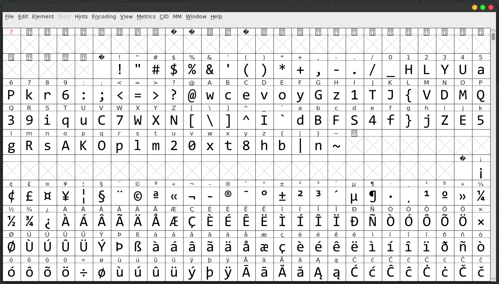

# Mirage - Solution

Created by Idan ([GitHub](https://github.com/idan22moral/) / [Twitter](https://twitter.com/idan_moral))

## Description
> "Your eyes can deceive you; don't trust them."\
-- Obi-Wan Kenobi<br><br>
https://mirage.hexionteam.com

## Solution
So we get a URL to a website that shows an image of random characters, and we have the ability to write a text as input.
<br><br>

<br><br>
When writing text, we see that the graphical representation of the input in not corrent (for example: when entering 'A', it prints 'w'). interesting.  
We understand that the text is a scrambled version of the flag in some way.

We have a few methods to approach this challenge:
1. try to bruteforce by hand to get the flag.  
Note: No explanation is needed - it'll take more than 2000 tries by hand in the worst case. not fun.
2. try to get a mapping for all the linked characters, then get the flag by hand (pretty fast method).
3. Write a script that uses the idea from method 2 (could be a little difficult since we need to make sense from the font's glyph names, but possible for sure).
4. probably more methods, you guys are creative.

I chose the 2rd method, since i think this is the fastest way, and you'll probably use this method as a middle-point in method 2.

So - the graphical representation is wrong -> the font has something interesting in it.  
We open the source code of the page and see:  

```html
<html>
    ...
    <style>
        ...
        
        @font-face {
            font-family: hexFont;
            src: url("assets/hexfont.ttf");
        }

        input {
            font-family: hexFont;
            font-size: 40px;
            font: url
        }
    </style>
    ...
</html>
```

There's a custom font called `hexfont.ttf`, let's download it by accessing https://mirage.hexionteam.com/assets/hexfont.ttf

The first tool that needs to come to your mind when a font is involded is `FontForge`  
(and for method 3/4: `fonttools` in python , I used it to create the challenge).

By opening the font in `FontForge` we get the following map of characters:<br><br>


As you can see the value 'h' is shown as 'j', 'e' as '4', etc.  
Now you can work it by hand, it's a very fast process.

Flag: `hexCTF{Don7_judge_a_B0Ok_by_1ts_c0v3r}`
